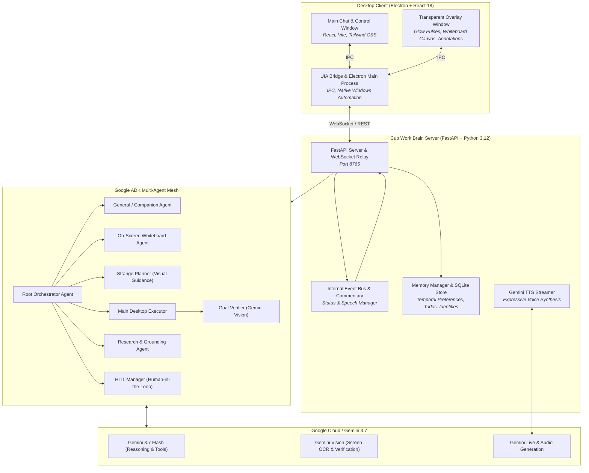

<div align="center">

# ☕ Cup Work (Hey Jave)
### *Your Autonomous Multimodal Desktop Companion & On-Screen AI Agent*

[](https://ai.google.dev/)
[](https://github.com/google/adk-python)
[](https://www.electronjs.org/)
[](https://react.dev/)
[](https://fastapi.tiangolo.com/)
[](LICENSE)

<p align="center">
  <strong>Cup Work</strong> transforms your desktop into an interactive, collaborative workspace. Powered by <strong>Google Gemini 3.7</strong> and the <strong>Google Agent Development Kit (ADK)</strong>, Cup Work acts as a talkative companion, an on-screen animated whiteboard tutor, an intuitive UI guide, and an autonomous visual Windows automation executor.
</p>

---

</div>

## 🌟 Table of Contents
- [⚡ Quick Start (2-Minute Spin-Up)](#-quick-start-2-minute-spin-up)
- [📖 Overview](#-overview)
- [🚀 Key Pillars & Capabilities](#-key-pillars--capabilities)
- [🏗️ System Architecture](#-system-architecture)
- [🤖 Multi-Agent Roster](#-multi-agent-roster)
- [📁 Project Structure](#-project-structure)
- [🛠️ Detailed Step-by-Step Spin-Up Guide](#-detailed-step-by-step-spin-up-guide)
  - [Prerequisites](#prerequisites)
  - [Step 1: Get a Gemini API Key](#step-1-get-a-gemini-api-key)
  - [Step 2: Clone the Repository & Configure Environment](#step-2-clone-the-repository--configure-environment)
  - [Step 3: Start the Backend Server (Terminal 1)](#step-3-start-the-backend-server-terminal-1)
  - [Step 4: Launch the Desktop Client (Terminal 2)](#step-4-launch-the-desktop-client-terminal-2)
- [🧪 60-Second "Test Drive" / Verification Guide](#-60-second-test-drive--verification-guide)
- [⚙️ Environment Configuration Reference](#-environment-configuration-reference)
- [📡 API & WebSocket Protocol](#-api--websocket-protocol)
- [🩺 Troubleshooting & Common Gotchas](#-troubleshooting--common-gotchas)
- [🧪 Running Automated Tests](#-running-automated-tests)
- [📄 License](#-license)

---

## ⚡ Quick Start (2-Minute Spin-Up)

For evaluators and judges who want to spin up Cup Work in under 2 minutes:

```bash
# 1. Clone the repository
git clone https://github.com/Niteesh57/Jave.git
cd Jave

# 2. Configure API Key (paste your Gemini API key in backend/.env)
cp backend/.env.example backend/.env
# Edit backend/.env and set: GEMINI_API_KEY=your_gemini_api_key_here
```

### In Terminal 1 (Python Backend Server):
```bash
cd backend
python -m venv .venv

# Activate Virtual Environment:
# Windows PowerShell:  .\.venv\Scripts\Activate.ps1
# Windows CMD:         .\.venv\Scripts\activate.bat
# macOS / Linux:       source .venv/bin/activate

pip install -r requirements.txt
python main.py
```
> Server will start at `http://127.0.0.1:8765` with `[OK] Cup Work Python Brain Server`.

### In Terminal 2 (Electron Desktop Client):
```bash
# From the project root:
npm install
npm run build:electron
npm start
```

🎉 **That's it!** The Cup Work desktop companion and transparent screen overlay will launch.

---

## 📖 Overview

Most desktop AI assistants are confined to a static sidebar chat box. **Cup Work** breaks free from the chat window:
- It **draws animated architectural diagrams** directly over your desktop screen with an auto-gliding camera.
- It **sees your screen** and highlights UI buttons, menus, and chessboard squares with real-time bounding boxes and pointer arrows.
- It **autonomously automates Windows apps** (MS Word, Excel, Chrome, File Explorer) through an `OBSERVE → ACT → MID-FLIGHT VERIFY → REDO` loop.
- It **speaks with human emotional inflection** using Gemini's streaming voice synthesis and emotional audio tags (`[excitedly]`, `[curious]`, `[whispers]`, `[thoughtful]`).
- It **remembers your habits and preferences** across sessions and devices using a temporal SQLite memory manager.

---

## 🚀 Key Pillars & Capabilities

### 1. On-Screen Infinite Whiteboard Agent (`on_screen_agent`)
When you ask conceptual or architectural questions (*"How does OAuth2 work?"*, *"Explain Kafka internal architecture"*, *"Teach me Kubernetes"*):
- **Precompiled Progressive Lectures**: Precompiles multi-step SVG sketch nodes (boxes, database cylinders, cloud services, and curved animated arrows).
- **Auto-Gliding Infinite Canvas**: Automatically pans and centers the virtual camera onto active nodes as each step unfolds.
- **Synchronized Voice Narration**: Speaks detailed explanations for every step using expressive Gemini TTS.
- **Mid-Flight Doubts & In-Flight Clarifications**: Ask a question mid-lecture (*"Wait, what if the consumer fails?"*) and the agent anchors a dynamic callout card to the active node without wiping the canvas.

### 2. Hierarchical ADK Multi-Agent Mesh
Built natively on the **Google Agent Development Kit (ADK)**:
- **`root_agent`**: Evaluates intent and dynamically transfers control to specialized agents.
- **Context Injection**: Every agent invocation receives aggregated prompt context containing active user preferences, active todo tasks, and short-term dialogue history.

### 3. Closed-Loop Desktop UI Automation (`main_executor`)
For end-to-end desktop task execution:
- **Windows UI Automation (UIA) Tree**: Inspects controls, ribbon tabs, buttons, and text fields via native Windows accessibility APIs.
- **Direct Mouse & Keyboard**: High-precision mouse clicks, smooth drags, scroll deltas, and hotkey combinations (`Ctrl+N`, `Ctrl+A`, `Ctrl+Alt+1`).
- **Mid-Flight Goal Verification (`goal_verifier`)**: Uses Gemini 3.7 Vision to capture a post-action screenshot and verify whether the sub-goal was visually achieved before proceeding or self-correcting.

### 4. Expressive Gemini TTS with Inline Emotion Tags
- Over 30 voice personalities (e.g., *Kore*, *Puck*, *Fenrir*, *Aoede*, *Sulafat*).
- Directly embeds natural emotion tags: `[excitedly]`, `[cheerfully]`, `[curious]`, `[thoughtful]`, `[serious]`, `[whispers]`, `[laughs]`.
- Low-latency real-time PCM/WAV audio streaming over WebSockets.

### 5. Visual Guidance & Strange Planner (`strange_planner`)
- Pinpoints options and buttons across web consoles and desktop software with normalized `[ymin, xmin, ymax, xmax]` bounding boxes and arrows.
- Analyzes strategy games (e.g. Chess) with precise 8x8 square grid calculations, drawing move arrows from origin to target square.

### 6. Long-Term Temporal Preference Memory
- **Temporal States**: Tracks preferences with `present` vs. `expired` states (e.g. *"user switched from React to Vue"*).
- **Multi-Device Sync**: Auto-provisions hardware IDs (`desktop-main`, `laptop-work`) and links them to user identities.
- **Integrated Todo Task Management**: Creates, updates, and tracks actionable tasks directly through voice or chat.

---

## 🏗️ System Architecture



---

## 🤖 Multi-Agent Roster

| Agent Name | Primary Responsibility | Key Tools |
| :--- | :--- | :--- |
| **`root_agent`** | Intent classification, session management, and dynamic routing | `take_screenshot`, `set_user_preference`, `create_todo_task`, `log_activity_event` |
| **`general_agent`** | Chit-chat, friendly banter, news broadcasts, places/trip planning, and todo lists | `search_and_explore_places`, `read_grounded_news`, `create_todo_task`, `list_todo_tasks` |
| **`on_screen_agent`** | Step-by-step whiteboard lectures, SVG sketch nodes, and in-flight doubt cards | `draw_whiteboard_lecture`, `draw_mermaid_diagram`, `add_whiteboard_clarification`, `close_whiteboard` |
| **`strange_planner`** | On-screen visual locating, bounding boxes, directional arrows, and chess analysis | `show_annotations`, `show_screenpad`, `uia_search_elements`, `uia_get_interactive_elements` |
| **`main_executor`** | Autonomous Windows desktop automation (`OBSERVE → ACT → VERIFY`) | `focus_window`, `mouse_click`, `keyboard_type`, `press_hotkey`, `scroll`, `drag_drop` |
| **`research_agent`** | Multi-source web synthesis, deep documentation queries, and fact gathering | Google Search grounding tools |
| **`clarification_agent`** | Interactive quizzes, parameter disambiguation, and user multiple-choice queries | `ask_human` |
| **`goal_verifier`** | Multimodal verification of screen state after automation actions | Gemini 3.7 Vision API |

---

## 📁 Project Structure

```text
hey_jave/
├── backend/                        # Python FastAPI & Google ADK backend
│   ├── adk_runner.py               # Google ADK Runner wrapper & execution lifecycle
│   ├── config.py                   # Environment & server settings
│   ├── main.py                     # Uvicorn entrypoint (Port 8765)
│   ├── models.py                   # Pydantic request/response schemas
│   ├── server.py                   # FastAPI routing, WebSockets & Event Bus bridge
│   ├── agents/                     # ADK Specialist Agents
│   │   ├── root_agent.py           # Root dynamic router
│   │   ├── general_agent.py        # Companion & places/news agent
│   │   ├── on_screen_agent.py      # Whiteboard sketch & lecture agent
│   │   ├── strange_planner.py      # Visual UI annotation & chess planner
│   │   ├── main_executor.py        # Desktop automation engine
│   │   ├── goal_verifier.py        # Gemini Vision sub-goal verifier
│   │   ├── hitl_manager.py         # Human-in-the-Loop decision manager
│   │   ├── research_agent.py       # Web research specialist
│   │   ├── clarification_agent.py  # Interactive Q&A and quiz agent
│   │   └── _tools.py               # Shared ADK tool bindings
│   ├── api/                        # REST API endpoint routers
│   ├── bridge/                     # WebSocket bridge to Electron
│   ├── core/                       # GenAI client initialization
│   ├── events/                     # Event bus & commentary translator
│   ├── memory/                     # Temporal memory & multi-device manager
│   ├── storage/                    # SQLite persistent store
│   ├── tools/                      # Native desktop tool definitions
│   └── voice/                      # Gemini streaming TTS engine
│
├── src/                            # Electron & React Frontend
│   ├── main/                       # Electron Main Process
│   │   ├── index.ts                # App lifecycle, IPC & WebSocket forwarder
│   │   ├── overlayWindow.ts        # Transparent click-through overlay window
│   │   ├── tts.ts                  # Audio streaming & speaker playback
│   │   └── bridge/                 # Windows UI Automation (UIA) bridge
│   ├── renderer/                   # React 18 Renderer Process
│   │   ├── App.tsx                 # Main UI, chat view, timeline & controls
│   │   ├── overlay.html            # Overlay view (Whiteboard, Glow, Badges)
│   │   ├── voiceEngine.ts          # Web Speech API & microphone capture
│   │   ├── audio/                  # Gemini PCM audio player
│   │   └── components/             # Reusable React components
│   │       ├── AgentFlowGraph.tsx  # Dynamic multi-agent state visualization
│   │       ├── CoffeeCup.tsx       # Mascot animation
│   │       ├── MovingColorsAvatar.tsx # Gemini live audio aura
│   │       ├── SettingsModal.tsx   # Model selection & server configuration
│   │       ├── TodoListModal.tsx   # Task management interface
│   │       └── ToolCallTimeline.tsx# Agent reasoning & tool execution log
│   └── shared/                     # Shared TypeScript interfaces & types
│
├── package.json                    # Node dependencies & scripts
├── vite.config.ts                  # Vite + Electron build configuration
└── tailwind.config.js              # Tailwind CSS styling configuration
```

---

## 🛠️ Detailed Step-by-Step Spin-Up Guide

### Prerequisites
Before running Cup Work, make sure your machine has:
1. **Node.js**: `v20.0.0` or newer ([Download Node.js](https://nodejs.org/))
2. **Python**: `3.11` or `3.12` ([Download Python](https://www.python.org/downloads/))
3. **Git**: Installed and configured on your system.
4. **Supported Operating Systems**:
   - **Windows 10 / 11** *(Recommended)*: Full native desktop UI Automation, transparent click-through screen overlay, OCR vision, and streaming audio.
   - **macOS / Linux**: Full companion chat, animated on-screen whiteboard lectures, Google Maps / Search grounding, news broadcasts, todo tasks, and mock desktop tool execution.

---

### Step 1: Get a Gemini API Key
1. Visit **[Google AI Studio](https://aistudio.google.com/apikey)**.
2. Sign in with your Google account and click **"Create API Key"**.
3. Copy your key (starts with `AIzaSy...`).

*(Alternatively, if you prefer Google Cloud Vertex AI, ensure your `gcloud` CLI is logged in or you have a service account JSON file ready).*

---

### Step 2: Clone the Repository & Configure Environment

```bash
# Clone the repository
git clone https://github.com/Niteesh57/Jave.git
cd Jave

# Copy backend environment template
cp backend/.env.example backend/.env
```

Open `backend/.env` in any text editor and configure your credentials:

```ini
# Option A: Standard Google AI Studio (Recommended & Simplest)
GEMINI_API_KEY=AIzaSyYourActualKeyHere
GOOGLE_GENAI_USE_VERTEXAI=false
GEMINI_MODEL=gemini-3.7-flash

# Server settings (defaults are pre-configured)
PYTHON_BACKEND_HOST=127.0.0.1
PYTHON_BACKEND_PORT=8765
UIA_TIMEOUT_MS=5000
ENABLE_VISION_FALLBACK=true
LOG_LEVEL=info
```

*(If using Vertex AI, set `GOOGLE_GENAI_USE_VERTEXAI=true`, `GOOGLE_CLOUD_PROJECT=your-project-id`, and `GOOGLE_APPLICATION_CREDENTIALS=/path/to/key.json`).*

---

### Step 3: Start the Backend Server (Terminal 1)

Open **Terminal 1** and run:

#### On Windows (PowerShell):
```powershell
cd backend
python -m venv .venv
.\.venv\Scripts\Activate.ps1
pip install -r requirements.txt
python main.py
```

#### On Windows (CMD):
```cmd
cd backend
python -m venv .venv
.\.venv\Scripts\activate.bat
pip install -r requirements.txt
python main.py
```

#### On macOS / Linux (Bash / Zsh):
```bash
cd backend
python3 -m venv .venv
source .venv/bin/activate
pip install -r requirements.txt
python main.py
```

#### ✅ Verify Backend Health:
You should see:
```text
=====================================================
  Cup Work Python Brain Server v2.0
  Host: 127.0.0.1:8765
  Vertex AI Mode: False
  Default Model: gemini-3.7-flash
=====================================================
INFO:     Started server process
INFO:     Uvicorn running on http://127.0.0.1:8765 (Press CTRL+C to quit)
```

In your browser or terminal, verify health check:
```powershell
# PowerShell
Invoke-RestMethod http://127.0.0.1:8765/health

# Or cURL
curl http://127.0.0.1:8765/health
```
Expected output: `{"status":"ok","service":"hey-jave-brain","default_model":"gemini-3.7-flash", ...}`

---

### Step 4: Launch the Desktop Client (Terminal 2)

Open **Terminal 2** from the root `Jave/` folder:

```bash
# 1. Install Node dependencies
npm install

# 2. Build the Electron main process scripts
npm run build:electron

# 3. Start Cup Work
npm start
```

*(For developers wanting live hot-reloading on renderer UI, run `npm run dev`)*.

---

## 🧪 60-Second "Test Drive" / Verification Guide

Once the Cup Work window opens, test these core capabilities to verify complete end-to-end functionality:

### 1. Test the On-Screen Animated Whiteboard (`on_screen_agent`)
Type or speak:
> *"Explain how Kafka internal partition architecture works with a diagram"*

- **What to expect**: The transparent whiteboard overlay activates on your screen. You will see animated SVG nodes (Producers, Broker Cylinders, Consumer Groups) drawn with curved arrows, an auto-gliding camera that centers on each step, and synchronized voice narration.
- *Press `ESC` to close the whiteboard at any time.*

### 2. Test In-Flight Doubt Clarification
While the whiteboard is active, ask:
> *"Wait, what happens if the broker node crashes?"*

- **What to expect**: Cup Work retains the active diagram and anchors a live clarification note directly next to the broker component with voice narration.

### 3. Test Places Grounding & Temporal Todo Memory (`general_agent`)
Type or speak:
> *"Find the top 3 coffee shops in Seattle and add visiting them to my todo list for today."*

- **What to expect**: The agent uses Google Search grounding to return real ratings, addresses, and recommendations, auto-creates todo items in the SQLite task database, and remembers your coffee interest. Click the **ListTodo** icon in the header to view your persistent task list.

### 4. Test Desktop Screen Perception & Guidance (`strange_planner`)
With any application or website open, ask:
> *"Where is the option to search on this screen?"*

- **What to expect**: Cup Work captures a screenshot and renders a high-contrast glowing highlight box and pointer arrow directly over the target element on your screen.

### 5. Test Closed-Loop Windows Desktop Automation (`main_executor`) *(Windows)*
Type or speak:
> *"Open Notepad, write a grocery list with apples, milk, and coffee, and make the window full screen."*

- **What to expect**: The agent focuses/launches Notepad, maximizes it, enters the text, captures a post-action screenshot, and calls `goal_verifier` to confirm completion visually.

---

## ⚙️ Environment Configuration Reference

| Variable | Default | Required? | Description |
| :--- | :--- | :---: | :--- |
| `GEMINI_API_KEY` | *(empty)* | **Yes** (if not Vertex) | API key from [Google AI Studio](https://aistudio.google.com/apikey). |
| `GOOGLE_GENAI_USE_VERTEXAI` | `false` | No | Set to `true` to authenticate via GCP Vertex AI. |
| `GOOGLE_CLOUD_PROJECT` | *(empty)* | If Vertex | Google Cloud Project ID. |
| `GOOGLE_APPLICATION_CREDENTIALS` | *(empty)* | If Vertex | Path to service account JSON credentials. |
| `GEMINI_MODEL` | `gemini-3.7-flash` | No | Gemini model for reasoning (`gemini-3.7-flash`, `gemini-2.5-flash`). |
| `PYTHON_BACKEND_HOST` | `127.0.0.1` | No | Host address for FastAPI backend server. |
| `PYTHON_BACKEND_PORT` | `8765` | No | Port for FastAPI backend & WebSocket forwarder. |
| `UIA_TIMEOUT_MS` | `5000` | No | Timeout for native Windows Accessibility UI queries. |
| `ENABLE_VISION_FALLBACK` | `true` | No | Falls back to vision OCR when UI elements lack accessibility labels. |
| `LOG_LEVEL` | `info` | No | Logging verbosity (`debug`, `info`, `warning`, `error`). |

---

## 📡 API & WebSocket Protocol

### REST Endpoints
- `GET  /health`: Health status, active clients, and default model.
- `POST /api/agent/chat`: Send text or base64 audio prompt to ADK multi-agent mesh.
- `POST /api/agent/stop`: Cancel the currently executing task.
- `POST /api/agent/pause/{task_id}`: Pause an in-flight automation task.
- `POST /api/agent/resume/{task_id}`: Resume a paused automation task.
- `GET  /api/todos`: Retrieve list of active and completed todos.
- `POST /api/todos`: Create a new todo task item.
- `GET  /api/preferences`: Retrieve temporal user preferences with status (`present`/`expired`).

### WebSocket Messages (`ws://127.0.0.1:8765/ws`)
- `REGISTER_DEVICE`: Electron client registers hardware ID (`dev_xxxx`) and links identity.
- `HUMAN_RESPONSE`: User answers a Human-in-the-Loop (HITL) multiple-choice prompt.
- `AGENT_STEP_UPDATE`: Broadcasts intermediate agent reasoning, tool execution, and state changes.
- `TTS_STREAM_CHUNK`: Streams raw audio chunks directly to frontend audio player.

---

## 🩺 Troubleshooting & Common Gotchas

### 1. PowerShell Script Execution Policy Error
If you see `File .venv\Scripts\Activate.ps1 cannot be loaded because running scripts is disabled`:
```powershell
Set-ExecutionPolicy -Scope Process -ExecutionPolicy Bypass
.\.venv\Scripts\Activate.ps1
```

### 2. Backend Port 8765 Already in Use
If port `8765` is occupied by another process:
1. Change `PYTHON_BACKEND_PORT=8766` in `backend/.env`.
2. Start the backend: `python main.py`.
3. In the Electron app, open **Settings** (gear icon) and set the Backend URL to `http://127.0.0.1:8766`.

### 3. Audio / Microphone Access in Electron
If speech recognition does not capture your voice:
- Make sure your microphone is enabled in Windows Settings -> *Privacy & Security* -> *Microphone*.
- You can always use text input in the chat box if microphone access is unavailable.

### 4. Windows Overlay Display
The screen overlay runs as a transparent, frameless window spanning your primary display. If multi-monitor setups shift the overlay, use `ESC` to dismiss or toggle the **Whiteboard** button in the header.

---

## 🧪 Running Automated Tests

Run backend tests to verify agent routing, memory management, and API endpoints:

```bash
cd backend
python -m pytest test_backend.py test_routes.py -v
```

---

## 📄 License

This project is licensed under the **MIT License** — see the [LICENSE](LICENSE) file for details.

<div align="center">
  <sub>Built with ❤️ for the Google Gemini Developer Competition.</sub>
</div>
