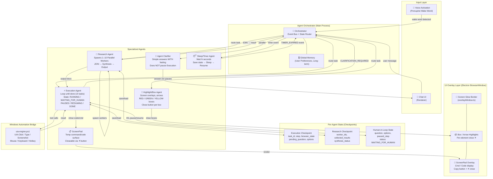
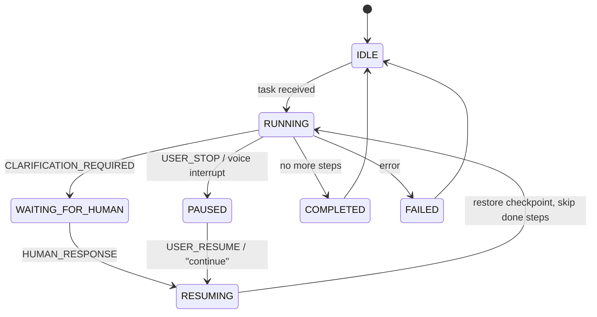

# Hey Jave — Multi-Agent Architecture Implementation Plan

## Overview

This plan upgrades Hey Jave from a single-loop execution runner into a **multi-agent, event-driven platform** with:

- **6 specialized agents**, each with their own persistent state
- **Human-in-the-loop** with checkpoint/resume (no restart from scratch)
- **ScreenPad** as a closeable temporary overlay surface
- **Box/Arrow Highlights** on screen with a close button
- **Research Agent** with 1–10 parallel worker threads
- **Long-running agents** with sleep/timer/wait support
- **Voice interrupt** handling (`porcupine` wake word) with concurrent clarification while execution continues

---

## Architecture Diagram



---

## Event-Driven State Machine



---

## Proposed Changes

### Phase 1 — Core Foundation

---

#### [MODIFY] [types.ts](file:///c:/Users/venka/hey_jave/src/shared/types.ts)

Add new shared types for multi-agent system:

- `AgentType` enum: `'execution' | 'research' | 'highlight' | 'clarifier' | 'sleep' | 'orchestrator'`
- `TaskLifecycle` type: `'IDLE' | 'RUNNING' | 'WAITING_FOR_HUMAN' | 'PAUSED' | 'RESUMING' | 'COMPLETED' | 'FAILED' | 'CANCELLED'`
- `TaskCheckpoint` interface: `{ taskId, agentType, status, currentStep, totalSteps, goal, browserContext, pendingQuestion, options, completedSteps[], timestamp }`
- `AgentEvent` interface: `{ type, taskId, payload }` for the event bus
- `HumanLoopRequest` interface: `{ question, options, context, taskId }`
- `HumanLoopResponse` interface: `{ answer, taskId }`
- `ResearchWorker` interface: `{ workerId, topic, status, result }`
- `HighlightBox` interface: `{ id, x, y, width, height, color, label, closeOnClick }`
- `ScreenPadContent` interface: `{ id, title, content, type: 'command' | 'code' | 'markdown' }`

---

#### [NEW] [src/main/orchestrator/agentOrchestrator.ts](file:///c:/Users/venka/hey_jave/src/main/orchestrator/agentOrchestrator.ts)

Central coordinator. Owns the event bus and routes messages between agents.

**Key responsibilities:**
- Maintain a registry of all active agents and their current `TaskLifecycle` status
- Emit and receive `AgentEvent`s (e.g. `CLARIFICATION_REQUIRED`, `HUMAN_RESPONSE`, `USER_STOP`, `TIMER_EXPIRED`)
- Route tasks to the correct specialized agent based on intent
- Manage agent lifecycle (start, pause, resume, cancel)
- Bridge between renderer IPC and agent layer

**Event types handled:**
```
TASK_SUBMIT           → route to correct agent
CLARIFICATION_REQUIRED → pause agent, show HumanLoop UI
HUMAN_RESPONSE         → resume agent from checkpoint
USER_STOP              → cancel/pause execution agent
USER_RESUME            → resume from last checkpoint
TIMER_EXPIRED          → wake up sleep agent
CHILD_TASK_COMPLETED   → check if research join is ready
AGENT_STEP_UPDATE      → forward to renderer UI
```

---

#### [NEW] [src/main/agent/agentStateManager.ts](file:///c:/Users/venka/hey_jave/src/main/agent/agentStateManager.ts)

Handles saving/restoring task checkpoints per agent. Persists to a local JSON file in the app data directory.

**Key methods:**
- `saveCheckpoint(checkpoint: TaskCheckpoint): void`
- `loadCheckpoint(taskId: string): TaskCheckpoint | null`
- `clearCheckpoint(taskId: string): void`
- `listActiveCheckpoints(): TaskCheckpoint[]`

---

### Phase 2 — Specialized Agents

---

#### [MODIFY] [src/main/agent/agentRunner.ts](file:///c:/Users/venka/hey_jave/src/main/agent/agentRunner.ts)

Refactor `AgentRunner` into the **Execution Agent** with full state support:

- Accept a `taskId` and `checkpoint?` as parameters
- Before each step, check `cancelToken.cancelled` — stop immediately if true
- On `CLARIFICATION_REQUIRED`: call `stateManager.saveCheckpoint(...)` and emit event, then suspend loop
- On resume: skip steps `<= checkpoint.currentStep` (already completed)
- On `USER_STOP` signal: checkpoint and set status to `PAUSED`
- Track `completedSteps[]` in checkpoint so resume skips them

---

#### [NEW] [src/main/agent/researchAgent.ts](file:///c:/Users/venka/hey_jave/src/main/agent/researchAgent.ts)

Parallel research agent:

- Accepts a topic and decomposed subtopics (from LLM)
- Spawns 1–10 worker `Promise`s in parallel (configurable max)
- Each worker calls Groq with a focused research sub-prompt
- All workers join (`Promise.all`) and results are synthesized
- Calls `ExecutionAgent` to write output (Notepad / Markdown file)
- Checks tool availability: Word → Notepad fallback path
- Saves intermediate worker state in checkpoint

**Parallel worker pattern:**
```typescript
const workers = subtopics.slice(0, MAX_WORKERS).map(async (topic, idx) => {
  // fetch from Groq, return result
});
const results = await Promise.all(workers);
// synthesize → output
```

---

#### [NEW] [src/main/agent/clarifierAgent.ts](file:///c:/Users/venka/hey_jave/src/main/agent/clarifierAgent.ts)

Side-channel clarification agent that answers without pausing Execution:

- Triggered concurrently when user asks a question mid-execution
- Access to the Execution Agent's `completedSteps[]` for context
- Returns a **short, natural language answer** (1–3 sentences max)
- Does NOT modify Execution Agent state
- Voice feedback: uses Gemini TTS or native `SpeechSynthesis` to speak the answer

---

#### [NEW] [src/main/agent/highlightAgent.ts](file:///c:/Users/venka/hey_jave/src/main/agent/highlightAgent.ts)

Screen overlay box/arrow renderer:

- Accepts `HighlightBox[]` from LLM tool calls
- Sends box positions to `overlayWindow` via IPC
- Renders colored (RED/GREEN/YELLOW) named boxes over the screen
- Each box has a close `✕` button
- "Clear All" button on the overlay
- Persists box state until user closes them

---

#### [NEW] [src/main/agent/sleepAgent.ts](file:///c:/Users/venka/hey_jave/src/main/agent/sleepAgent.ts)

Timer/sleep agent:

- Triggered when execution encounters `wait N seconds`
- Saves full Execution Agent checkpoint
- Uses `setTimeout` (not a busy loop) to sleep
- On `TIMER_EXPIRED`: restores checkpoint and emits `RESUMING` event
- Reports to user: `"30 seconds have passed. Ready to continue."`

---

### Phase 3 — UI & Overlay

---

#### [MODIFY] [src/main/overlayWindow.ts](file:///c:/Users/venka/hey_jave/src/main/overlayWindow.ts)

Add new IPC channels to the overlay:

- `overlay:show-box` → render highlight box at `{x, y, w, h, color, label, id}`
- `overlay:close-box` → remove specific box by id
- `overlay:clear-boxes` → remove all highlight boxes
- `overlay:show-screenpad` → show ScreenPad with `{title, content, type}`
- `overlay:close-screenpad` → hide ScreenPad

---

#### [MODIFY] [src/renderer/overlay.html](file:///c:/Users/venka/hey_jave/src/renderer/overlay.html)

Add two new overlay components to the existing glow overlay:

**ScreenPad Component:**
```html
<div id="screenpad" class="screenpad hidden">
  <div class="screenpad-header">
    <span id="screenpad-title">AI Suggested Command</span>
    <button id="screenpad-close" class="close-btn">✕</button>
  </div>
  <pre id="screenpad-content"></pre>
  <button id="screenpad-copy">📋 Copy</button>
</div>
```

**Box Highlight Container:**
```html
<div id="box-layer"></div>
<!-- Each box injected dynamically as:
  <div class="highlight-box" style="left:Xpx; top:Ypx; width:Wpx; height:Hpx; border-color: green">
    <span class="box-label">Knight → e5 (Best Move)</span>
    <button class="box-close">✕</button>
  </div>
-->
```

---

#### [MODIFY] [src/renderer/App.tsx](file:///c:/Users/venka/hey_jave/src/renderer/App.tsx)

Add to the renderer UI:

- **Human-in-Loop panel**: appears when agent sends `agent:human-loop-request` IPC event
  - Shows `question` text + `options[]` as clickable buttons
  - User selects answer → sends `agent:human-loop-response` back to main
  - Panel closes after response

- **Interrupt button**: `🛑 Stop` button that becomes active during execution
  - Sends `agent:user-stop` IPC event

- **Continue button**: appears when task is `PAUSED`
  - Sends `agent:user-resume` IPC event

- **Agent Status chips**: shows which agents are currently active (e.g. `⚡ Execution`, `🔬 Research`)

---

#### [MODIFY] [src/main/index.ts](file:///c:/Users/venka/hey_jave/src/main/index.ts)

Add new IPC handlers:

- `agent:human-loop-response` → forward answer to Orchestrator
- `agent:user-stop` → emit `USER_STOP` event to Orchestrator
- `agent:user-resume` → emit `USER_RESUME` event to Orchestrator
- `agent:close-screenpad` → call `overlayWindow:close-screenpad`
- `agent:close-box` → call `overlayWindow:close-box`
- `agent:clear-boxes` → call `overlayWindow:clear-all-boxes`

---

### Phase 4 — Tool Declarations

---

#### [MODIFY] [src/main/agent/tools.ts](file:///c:/Users/venka/hey_jave/src/main/agent/tools.ts)

Add new tool declarations for:

- `highlight_box`: Draw a colored box on screen `{ x, y, width, height, color: 'red'|'green'|'yellow', label }`
- `clear_highlights`: Remove all overlay boxes
- `show_screenpad`: Show ScreenPad with command/code `{ title, content, type }`
- `close_screenpad`: Hide the ScreenPad
- `wait_seconds`: Trigger SleepAgent `{ seconds: number }`
- `ask_human`: Trigger Human-in-Loop `{ question, options[] }`
- `spawn_research_worker`: Spawn a subtopic research task `{ topic, subtopic }`

---

### Phase 5 — Voice Architecture

---

#### [MODIFY] Voice Activation (existing `porcupine` integration)

The existing voice activation already records audio. Add:

- **Concurrent voice processing**: while Execution Agent runs, voice is still listened to
- **Intent classifier**: distinguish between:
  - `CLARIFICATION` → route to `ClarifierAgent` (non-blocking)
  - `STOP` → emit `USER_STOP` to Orchestrator
  - `CONTINUE/RESUME` → emit `USER_RESUME`
  - `NEW_TASK` → queue new task in Orchestrator

---

## File Tree (New Files Only)

```
src/
├── main/
│   ├── orchestrator/
│   │   └── agentOrchestrator.ts       [NEW]
│   └── agent/
│       ├── agentRunner.ts             [MODIFY]
│       ├── agentStateManager.ts       [NEW]
│       ├── researchAgent.ts           [NEW]
│       ├── clarifierAgent.ts          [NEW]
│       ├── highlightAgent.ts          [NEW]
│       ├── sleepAgent.ts              [NEW]
│       └── tools.ts                  [MODIFY]
├── shared/
│   └── types.ts                       [MODIFY]
├── renderer/
│   ├── App.tsx                        [MODIFY]
│   └── overlay.html                   [MODIFY]
└── bridge/
    └── uia-engine.ps1                 [MODIFY — add SCROLL action]
```

---

## Phased Rollout

| Phase | What | Priority |
|---|---|---|
| 1 | Types + StateManager + Orchestrator skeleton | Foundation |
| 2 | ExecutionAgent refactor with checkpoint/resume | Core |
| 3 | Human-in-loop UI panel + IPC events | Core |
| 4 | ScreenPad overlay + close button | UI |
| 5 | Box/Arrow highlight overlay + close button | UI |
| 6 | ClarifierAgent (parallel, non-blocking) | UX |
| 7 | SleepAgent (timer/wait) | Long-running |
| 8 | ResearchAgent (parallel workers + join) | Advanced |
| 9 | Voice interrupt intent classifier | Advanced |

---

## Open Questions

> [!IMPORTANT]
> **Q1:** For Human-in-Loop, should the ScreenPad show the question + options, or should it appear as a separate modal panel inside the main app window?

> [!IMPORTANT]
> **Q2:** For the Research Agent — should the synthesis output be automatically written to a file (Notepad/Markdown), or should it first show in the ScreenPad for the user to confirm before saving?

> [!IMPORTANT]
> **Q3:** For the Chess/Highlight Agent — should clicking a GREEN box automatically trigger the move (via `mouse_click` at that position), or should it only highlight and wait for you to manually move?

> [!NOTE]
> **Q4:** Should the Sleep/Timer Agent speak a voice notification when the timer expires, or only show a text update in the chat UI?
